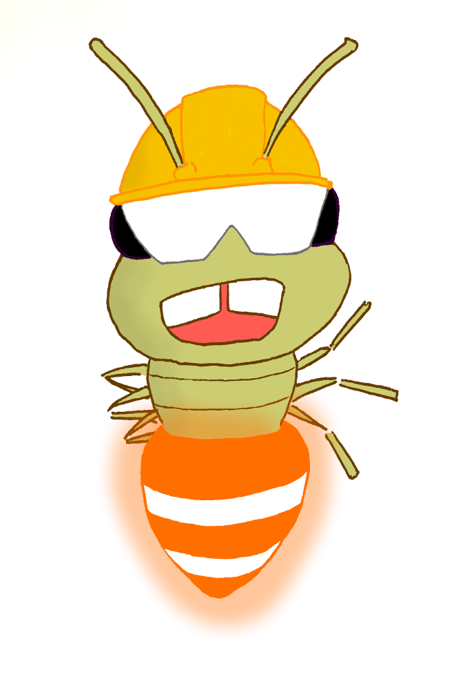

**Quality**  

**Build & deploy** 

**License** 

## Firefly
C++ and Angular2 Web Application to have remote access to Fly library functionalities.
Larger purpose would be to have access to high level OpenCV features.

#### Contributors
- Célian Garcia 

#### Used technologies
- [Docker](https://www.docker.com/)
- [Cmake](https://github.com/Kitware/CMake)
- [Angular 4](https://github.com/angular/angular)
- [OpenCV](https://github.com/opencv/opencv)
- [C++ Fly Library](https://github.com/celian-garcia/fly)
- [C++ Boost Library](https://github.com/boostorg/boost)
- [PostgreSQL](http://www.postgresqlfr.org/)

#### Documentation
- [Architecture](../../wiki/Architecture)
- [Reference documentation](../../wiki/Reference-documentation) (Generated by [Doxygen](https://github.com/doxygen/doxygen))
- [User documentation](../../wiki/User-documentation)
    - [API interface definition](../../wiki/User-documentation#api-interface-definition)
    - [Installation](../../wiki/User-documentation#installation)

#### Licence 
[GNU GPL v3](./LICENCE.txt)
